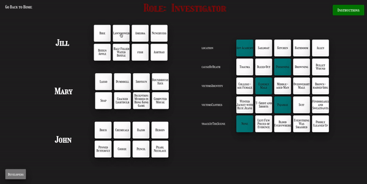
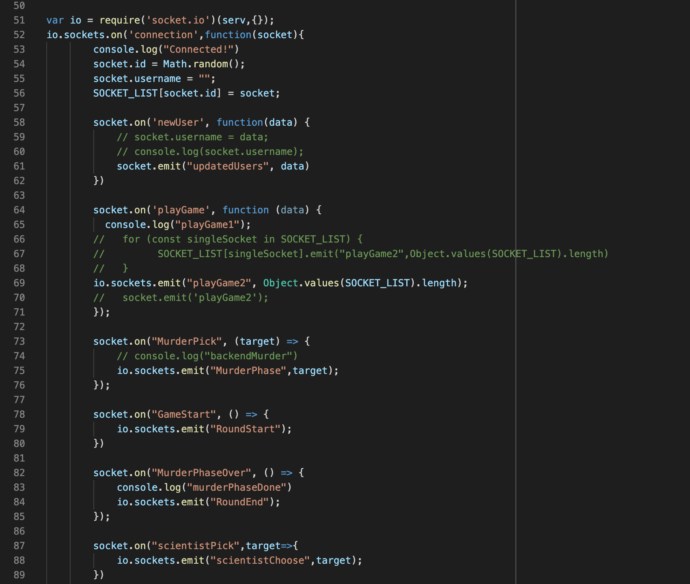

# Deception

Based on the social deduction game Deception: Murder in Hong Kong, this online implementation requires players to work together in order
to solve the mystery and determine whom among them is the murderer. 

[Live Site](https://deception.herokuapp.com/#/)

## Table of Contents
* [Technologies](#technologies)
* [Features](#features)
* [Installation](#installation)

## Technologies 

* React (version 16.13.1)
* Node
* Express (version 4.17.1)
* Mongoose (version 5.9.9)
* MongoDB
* Socket.io (version 2.3.0)
* HTML 5
* CSS 3

## Features
### Player Interaction 
The most important aspect of the game revolves around all players working in unison. This functionality is dependent upon the use of 
the library Socket.io in order to utilize websockets to be able to update all players' screens simultaneously. This is done
through Socket.io's Emits, and listen functionality.

Above is a snippet of our server's sockets that are listening and issuing commands. Each socket follows a similiar pattern of listening for a command and then isuuing a response to said command, sometimes passing data inbetween. 

## Installation 
To run both the frontend and backend servers with one command, run npm run dev. 

Otherwise, use npm run server in the top-level folder and then navigate into the frontend folder of the project and run npm start

